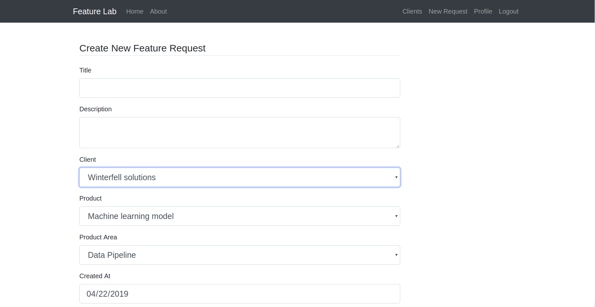
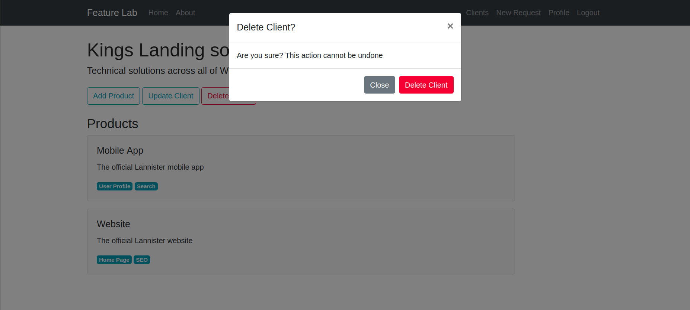

# Feature Lab
A test project for client feature requests management system.

# What is included?
- Flask as server-side framework
- Flask Blueprints for project organization
- flask-wtf for forms
- flask-sqlalchemy for databases
- flask-login for user authentication and session management
- flask-bcrypt for passwords hashing & checking
- Jinja2 for templating 
- jQuery for AJAX requests and UI interactivity 
- Bootstrap as front-end framework

# Structure & Design
### Database
This project has its database designed with 5 main entities:
- **User**: The employee having correspondence with the clients and using this system to manage their feature requests
- **Client**: The organization or company that receives the service and has products to which it demands feature requests
- **Product**: The software product that the client desires to improve with feature requests
- **ProductArea**: A main specific part of functionality of some product
- **FeatureRequest**: A request issued by the client and created by the user that describes the desired feature to be added and its details

So, a User has Clients, a Client has Products, a Product has FeatureRequest's and ProductArea's, and each FeatureRequest is assigned to a specific Product for a specific ProductArea.

### Backend
The project utilizes Flask Blueprints to separate the backend logic into the following packages:
- **main**: has the basic like home and about directories
- **users**: has the authentication & profile directories
- **clients**: has the routes related to clients, products and feature requests and their logic

### Frontend 
Jinja2, WTForms, and jQuery were used to create the interactive templates of this project and enhance the user experience with guiding messages that helps the user navigating the application.

# Screenshots

# Setting up

# Running the app